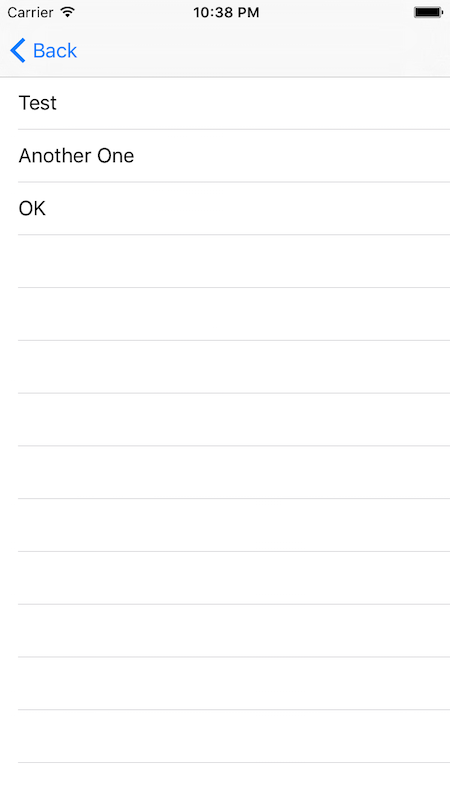

[](https://github.com/Carthage/Carthage)

Looking for Swift 3 support? Look [no further](https://github.com/Ben-G/ListKit/tree/swift-3).

#ListKit

ListKit allows you to use table views in your app **without implementing the `UITableViewDataSource` protocol yourself**. The framework provides different ways to initialize a table view with custom cells. ListKit uses generics to ensure that the content displayed in the table view matches the custom cells you are providing.

Instead configure a data source with your content and your custom cell:

	dataSource = ArrayDataSource(array: ["Test", "Another One", "OK"], cellType: CustomTableViewCell.self)
	tableView.dataSource = dataSource
	
#Installation

##Carthage

	github "Ben-G/ListKit"
	
##CocoaPods

	pod 'ListKit'

#Usage

You can find both examples below as part of the demo project in this repository.

##Table View with Simple Custom Cell

A table view that doesn't require a cell with a XIB file can be implemented as following:

```swift
class CustomTableViewCell: UITableViewCell, ListKitCellProtocol {
  var model: String? {
    didSet {
      self.textLabel!.text = model as String?
    }
  }
}

class ViewController: UIViewController {

  @IBOutlet weak var tableView: UITableView!
  
  var dataSource: ArrayDataSource<CustomTableViewCell, String>?
  
  override func viewDidLoad() {
    super.viewDidLoad()
    
    dataSource = ArrayDataSource(array: ["Test", "Another One", "OK"], cellType: CustomTableViewCell.self)
    tableView.dataSource = dataSource
  }

}
```
	
The most relevant steps for this setup are:

1. The `CustomTableViewCell` needs to implement the `ListKitCellProtocol`. That requires defining a `model` property with the type of content the cell can store. 
2. The `ArrayDataSource` needs to be configured with the types of the both the custom cell and the type of content stored in the cell.
3. The `ArrayDataSource` needs to be initialized with the custom cell type and optionally with the initial content of the table view, represented by an array. 
	
The result will look like this:



##Table View with Custom Cell in XIB File

If you want to use a custom cell that's layout is defined by a XIB file you need to use a slightly different API.

You will likely create a separate Swift file for your custom cell, it needs to implement the `ListKitCellProtocol`:

```swift
class CityCell: UITableViewCell, ListKitCellProtocol {
  
    @IBOutlet var mainImageView: UIImageView!
    @IBOutlet var subLabel: UILabel!
    @IBOutlet var mainLabel: UILabel!
  
    var model: City? {
      didSet {
        if mainLabel != nil {
          configureCell()
        }
      }
    }
  
  override func awakeFromNib() {
    super.awakeFromNib()
    
    configureCell()
  }
  
  func configureCell() {
    mainLabel.text = model?.name
    subLabel.text = model?.country
    mainImageView.image = model?.image
  }

}
```
	
From within your view controller you can configure the table view and data source as following:

```swift
let cities = [city1, city2]

let nib = UINib(nibName: "CityCell", bundle: NSBundle.mainBundle())

dataSource = ArrayDataSource(array: cities, cellType: CityCell.self, nib: nib)
tableView.dataSource = dataSource
```
    
The setup is very similar to the first example, however you now need to provide a `nib` name additionally to the type of the custom cell.

The result from the demo looks as following:


#Acknowledgements

I first encountered the idea of an `ArrayDataSource` [in objc.io issue #1](https://www.objc.io/issues/1-view-controllers/lighter-view-controllers/). This microframework is based on the idea from the article. This project takes a slightly different approach and also adds type safety by leveraging Swift generics.


