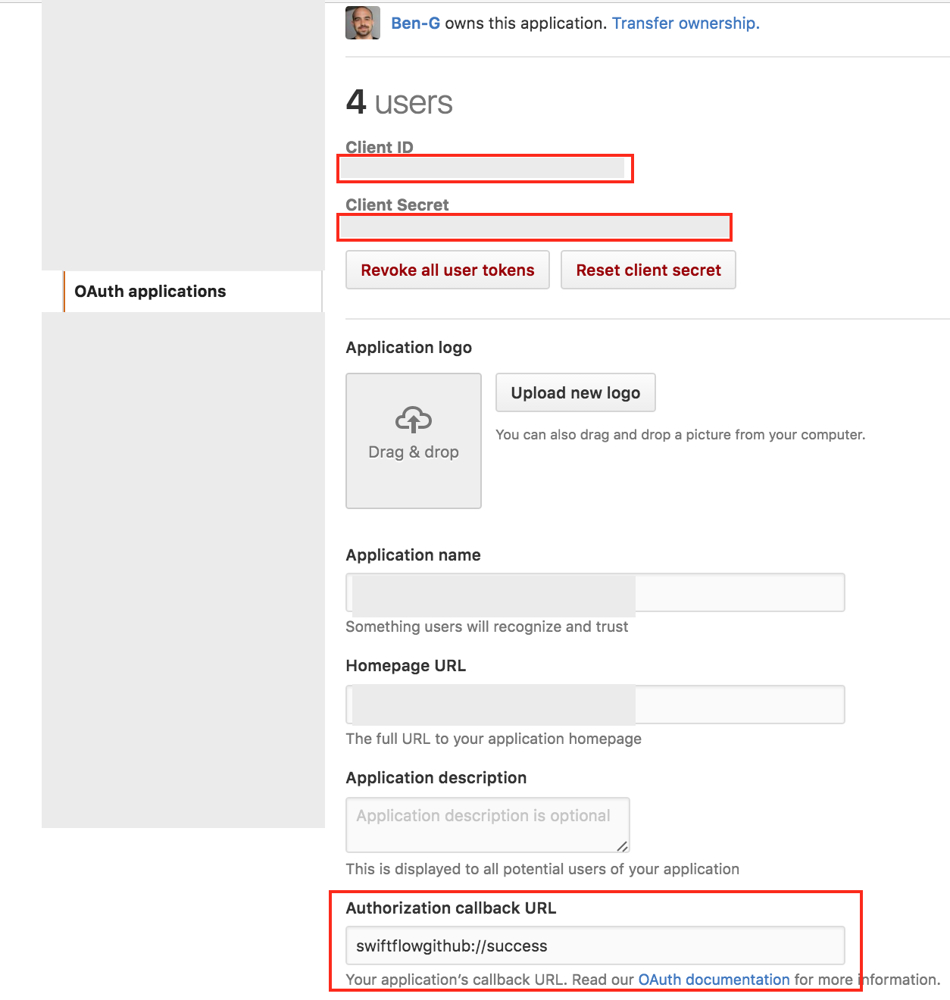

Work-in-Progress Real World Example for Swift Flow.

This project is currently driving some API changes, so it is using newer APIs than provided by the latest Swift Flow releases.

Successful API changes will be merged into the Swift Flow projects.

# Checking out Project & Dependencies

In order to install the projects dependencies, run the following Carthage command in the root directory:

```
carthage update --no-build
```

# GitHub Configuration Instructions

This demo requires you to create a GitHub API token that provides the app with access to content on GitHub.

Create an OAuth application on GitHub and note the **Client ID** and the **Client Secret**; also make sure to set the **Authorization callback URL** to `swiftflowgithub://success` as shown here:



Open `Credentials.swift` and enter the **Client ID** and the **Client Secret** of your OAuth application:

```swift
// In order to try out this demo you need to create an OAuth application on GitHub and provide
// the credentials here.
//
// For more instructions take a look at the README.md in this git repository.
//
// Insert GitHub Token and Secret Here
let gitHubClientId = ""
let gitHubClientSecret = ""
```